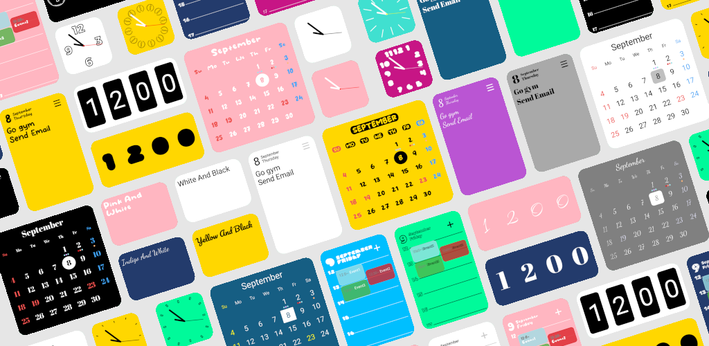
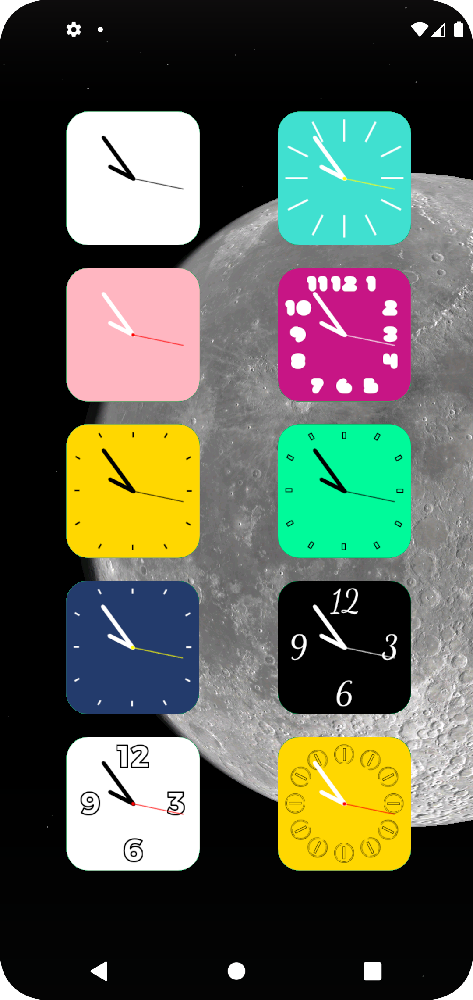
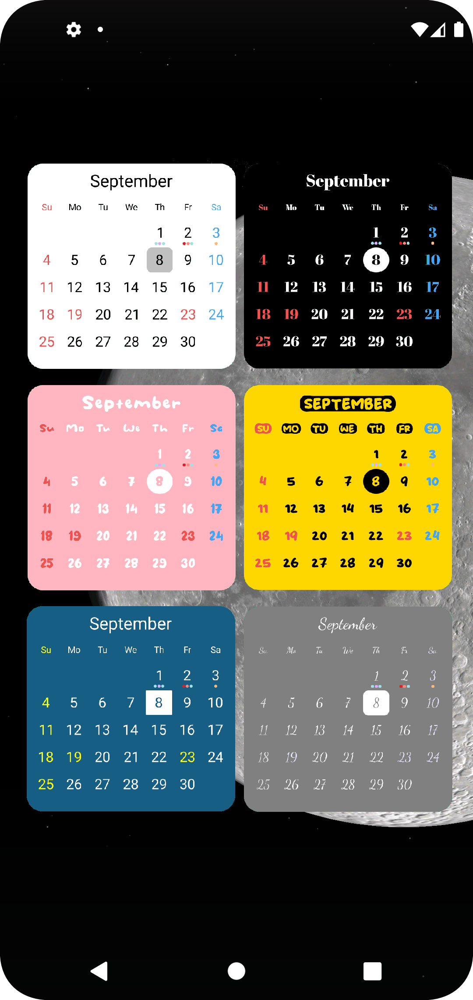
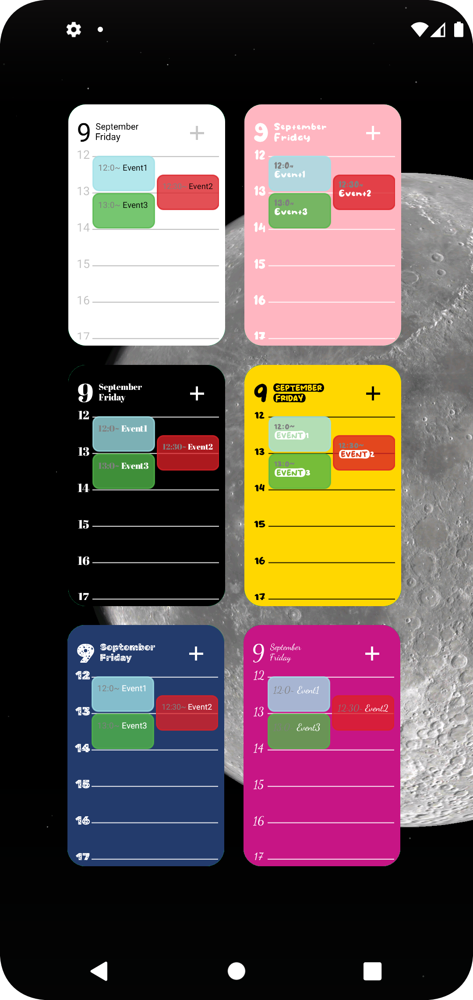
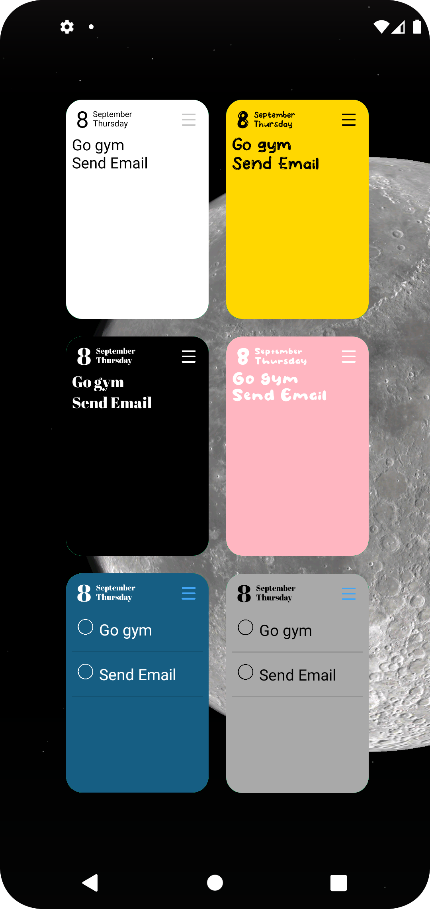
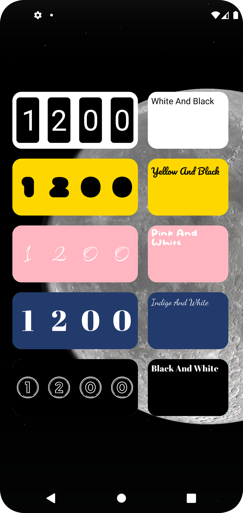

# Widget-Collection 📱

Android向けのカスタムウィジェットアプリのコレクションです。
ホーム画面等に配置して利用できる、様々なデザインと機能を持つウィジェットのソースコードを管理しています。

> **⚠️ Notice**
> 現在、このアプリケーションは一般公開（Google Playストア等での配信）を行っていません。

## スクリーンショット (Overview)

<div align="center">
  
</div>

> ホーム画面を彩る、ポップでカラフルなものからシックでシンプルなものまで、多彩なバリエーションを用意しています。

## 収録ウィジェット (Included Widgets)

本プロジェクトには、日常使いに便利な以下のUIコンポーネントが含まれています。

* **Clock (時計):** アナログ時計、デジタル時計
* **Calendar (カレンダー):** 月間カレンダーウィジェット
* **Schedule / Events (スケジュール):** その日の予定やタイムラインを表示
* **ToDo List (タスク):** シンプルなチェックリスト
* **Counter (カウンター):** レトロなフリップ時計風・メーター風の数値表示

### ウィジェットギャラリー

<div align="center">
  
  
  
</div>
<br>
<div align="center">
  
  
</div>

## 🛠 使用技術 (Tech Stack)

* **Language:** Java
* **Platform:** Android
* **Build System:** Gradle

## 📁 構成 (Project Structure)

* `src/`: アプリケーションのソースコード（Javaファイル、リソースファイル、AndroidManifest.xml など）
* `screenshot/`: README等で使用するスクリーンショット画像
* `build.gradle`: プロジェクトの依存関係やビルド設定

## 🚀 実行方法 (Getting Started)

ローカル環境（Android Studio）でプロジェクトをビルドして実行するための手順です。

### 前提条件 (Prerequisites)

* [Android Studio](https://developer.android.com/studio) がインストールされていること
* JDK (Java Development Kit) がセットアップされていること
* Android エミュレータ、もしくはデバッグ接続された実機端末があること

### インストールと起動 (Installation & Run)

1. リポジトリをローカルにクローンします。
   ```bash
   git clone [https://github.com/rayray-swamp/Widget-Collection.git](https://github.com/rayray-swamp/Widget-Collection.git)
